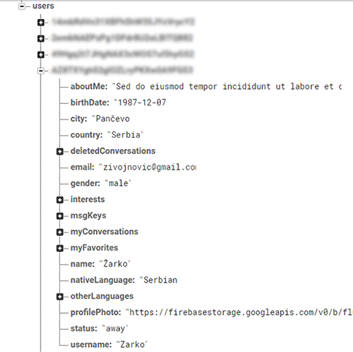

# Fluency
    
### Online [DEMO](http://fluency.epizy.com) version
   
---

This is a real time chat and video chat application for learning foreign languages. It differs from
other applications because you can be both a teacher and the student. You can help someone to master the language you know well,
and someone else will help you. The application is easy to use. Find your perfect conversation partner and enjoy in chat, while at the
same time practicing your language skills. The text chat will help you to improve your written technique 
and you can practice your spoken skills trough video chat. After the conversation, do not forget to rate
the user. That will help other users to choose the right interlocutor.  
\
\
For the back-end we used Firebase authentication for login, Firebase database to store all the data and Firebase storage to store profile photos.
We have three pages here. The first two are for login and registration, and the third is for the dashboard where all other parts of the application are displayed.
The dashboard has 6 main parts:
- My messages *- There is a list of all conversations* 
- My profile *- To see how your profile looks like*
- My favorites *- List of your favorite users*
- My block list *- List of blocked users*
- Channels *- List of online users and search form by language and level*
- Settings *- Here you can find edit profile, change password and delete profile forms*
---
Blocked users will not be displayed on the online users list and you will not receive messages from them.
But if you change your mind, you can unblock them.
***   

#### Registration:

You need to enter unique email and username for registration. Verification email will be sent after successful registration and
until email is unverified you will not be able to access the content of the application.

---

---

#### Forgot password:

If you forget the password you can require an email to reset it.

---

#### Login / Logout:

For login you must enter email and password. After successful logging you will be redirected to dashboard and your status will be changed to "online".
By clicking on *"Sign Out"* button status will be setted to "offline", same as you leave the page.
Third status option is "away" and it will appear if there is no activity on the page.

---

#### Channels:

All online users will be displayed on this page. If you want to filter users by language you must select one of the options in select list.
There is also an option to search users by username and on this page you can to send message or video chat call to someone.

---

---

#### Users profile information (personal info, about me, language info):

Every user can fill in this forms with their data. It is not mandatory but it would be good to add data about languages.
  * If you want to add photo in your profile you can do it by clicking on _**"profile photo"**_ in the sidebar. 
  * In _**personal info**_ section you can add your name, city, country, birthday and gender.
  * _**About me**_ section is about your interests and there is some text area to write what you want about yourself.
  * and the last and most important section - _**languages**_ where you can add your native language and other languages you speak. For the every language you can choose the level. Offered options are: *elementary*, *intermediate* and *advanced*.
 
---    

---

---

#### Messages:

All your conversations are in this section. They are sorted by received date. If you add a new
conversation it will be placed on top of the list. When new message is received you will get a 
notification in the sidebar and also next to the name of conversation. 
\
\
By clicking on the conversation name (displayed as same as username of your conversation partner)
you will see conversation content. Only 20 last messages will be displayed. At the top of conversation
will be placed _**"whole conversation"**_ button and clicking on it will be printed whole conversation.
\
\
Below the message in chat, the message status is printed _(**sent** and **seen**)_ and that be automatically
updated when the message is seen.
\
\
Do not forget to rate your interlocutor. You can rate the same user how many time you want but current evaluation
will cancel the previous one.
\
\
Also, you can to delete the conversation. If you start a new conversation with this user, deleted messages 
will not be available.  

---

---    

---

#### Other options: 

When you open someone's profile, you will see _**"Add To Favorites"**_ and _**"Block"**_ buttons.
If that user is already on your favorites list you can remove him from the list. The same applies to the 
block list.
\
Whenever you want, you can edit your profile. Also, you can change your password at any time.
\
And if you do not want to use our application any more, you can delete profile. 
By deleting the profile, all data will be permanently lost.

---

#### If you have some trouble with our application, feel free to contact us by [email](mailto:appfluency@gmail.com)

---
---

## Technologies we used

---

#### Firebase:

As I mentioned earlier, we used Firebase for back-end. At the beginning of the code we had to 
initialize Firebase with a configuration object. We included some Firebase libraries to handle this.
\
\
At the first place we made registration with _**"Firebase Authentication"**_. 
This part checks if the email address or username is reserved and whether the password is strong enough.

```angular2html
firebase.auth().createUserWithEmailAndPassword(email, password).then(() => {
                let user = firebase.auth().currentUser;
                user.sendEmailVerification().then(() => {
                    alert("Verification Email Sent");
                })
            })
```

For the login page we used this technology, too. The code looks like this:

```angular2html
firebase.auth().signInWithEmailAndPassword(email, password).then(() => {
    userId = firebase.auth().currentUser.uid;
    setStatus("online", userId);
    alert("You Are Online");
    location.assign('./dashboard.html');
}).catch(error => {
    alert(error);
});
```

---

_**"Firebase Database"**_ was used for data storage. All the data are stored as JSON object.



----

This is one of the functions that writes data into the database:

```angular2html
function writeUserDataOnRegistration(username, email) {
    let userId = firebase.auth().currentUser.uid;
    firebase.database().ref('users/' + userId).set({
        username,
        email
    });
}
```
The function expects two arguments, name and email, and forwards the object that will be saved in database.
\
\
And another one that reads data from database:

```angular2html
function getExistingData(userId) {
    let profileData = {};
    firebase.database().ref('users/' + userId).on('child_added', data => {
        profileData[data.key] = data.val();
    });
    return profileData;
}
```
---

For upload and storing photos we used _**"Firebase Storage"**_. It allows us to upload
the photos directly from mobile devices and web browsers, and keeps it safe because only authenticated users
can read and write data in storage.

----

#### WebRTC:

Video chat is enabled by WebRTC. This is the open project that provides browsers with Real-Time Communications
(RTC) capabilities via APIs. It is available in all popular browsers.
WebRTC implements three APIs: MediaStream, RTCPeerConnection and RTCDataChannel. We used only first two. 

---

##### MediaStream API

The MediaStream API represents synchronized streams of media. A stream taken from camera and 
microphone input has synchronized video and audio tracks.

Navigator.getUserMedia() method prompts the user for permission to use camera and
 microphone as the source for a MediaStream. If permission is granted, a MediaStream
 whose video and/or audio tracks come from those devices is delivered to the 
 specified success callback.
 
 ```angular2html
function showMyFace() {
    navigator.mediaDevices.getUserMedia({audio: true, video: true})
        .then(stream => yourVideo.srcObject = stream)
        .then(stream => pc.addStream(stream))
        .then(showFriendsFace);
}

function showFriendsFace() {
    pc.createOffer()
        .then(offer => pc.setLocalDescription(offer))
        .then(() => sendVideoMessage(yourId, JSON.stringify({'sdp': pc.localDescription})));
}
```

##### RTCPeerConnestion API

WebRTC uses RTCPeerConnection to communicate streaming data between browsers. 
But also needs a mechanism to coordinate communication and to send control messages, 
a process known as signalling. Signalling methods and protocols are not specified by WebRTC.
For this purpose we used an already existing database. RTCPeerConnection is the WebRTC 
component that handles stable and efficient communication of streaming data 
between peers. This functions below do it.

```angular2html
function startWebRTC(remoteUser) {
    conversationKey = createConversationKey(myProfileData.username, remoteUser);
    firebase.database().ref('calls/' + conversationKey).set({"call": "call"});
    videoDatabase = firebase.database().ref('calls/' + conversationKey);
    yourId = Math.floor(Math.random() * 1000000000);
    pc = new RTCPeerConnection(servers);
    pc.onicecandidate = (event => event.candidate ? sendVideoMessage(yourId, JSON.stringify({'ice': event.candidate})) : console.log("Sent All Ice") );
    pc.onaddstream = (event => friendsVideo.srcObject = event.stream);
    videoDatabase.on('child_added', readMessage);
}
```
```angular2html
function readMessage(data) {
    let string = data.val();
    if (string === "call") return;
    let msg = JSON.parse(string.message);
    let sender = data.val().sender;
    if (sender !== yourId) {
        if (msg.ice !== undefined)
            pc.addIceCandidate(new RTCIceCandidate(msg.ice));
        else if (msg.sdp.type === "offer")
            pc.setRemoteDescription(new RTCSessionDescription(msg.sdp))
                .then(() => pc.createAnswer())
                .then(answer => pc.setLocalDescription(answer))
                .then(() => sendVideoMessage(yourId, JSON.stringify({'sdp': pc.localDescription})));
        else if (msg.sdp.type === "answer")
            pc.setRemoteDescription(new RTCSessionDescription(msg.sdp));
    }
}
```
***

The Google Chrome requires secure protocol for camera and microphone access and because that on our 
online version may have some issues. This is the relatively new technology and it's still under development.
This means that this version of our application will not work for a long time. The other problem with WebRTC 
can be the list of necessary codecs. But for now everything works fine on https and localhost protocols.

---

#### The code that we wrote:

The whole JS code was written using the ECMAScript 6 syntax and divided into seven Javascript files _(main.js, dashScript.js, 
search.js, blockAndFavorites.js, messages.js, uploadingProfilePhoto.js and settings.js)_.

---

At the time we worked on application, we did not know much about _Promises_, and were 
dealing with the asyncronous using setInterval method. That is the thing we need to change. 
This is the sample:

```angular2html
let getUsername = setInterval(() => {
    ifUser(getUsername)
    }, 100),
    currentUser = firebase.auth().currentUser;
                  
function ifUser(getUsername) {
    if (myProfileData.username !== undefined) {
        clearInterval(getUsername);
        usersName.innerText = myProfileData.username;
        hide(loading);
        showChannels();
        markSelectedLink("channels");
    }
}
```

---

To show the user's profile, we used default HTML model we previously created. We have created a function 
that writes data into that model. There is also a function that removes data. We did not want 
to use too much DOM manipulations and we assessed this as a good solution.

---

We used a similar logic to add (and remove) from favorite list or list of blocked users, so we
made mutual functions for this.

```angular2html
function addOrRemoveFromList(event) {
    event.stopPropagation();
    let  user = event.target.name,
        btn = event.target.id === "blockBtn" ? blockBtn:addToFavsBtn,
        favOrBlock = btn === blockBtn ? myProfileData.myBlockList : myProfileData.myFavorites;
    if (favOrBlock.indexOf(user) === -1) {
        addToList(favOrBlock, user);
    } else {
        removeFromList(favOrBlock, user);
    }
}

function addToList(favOrBlock, user) {
    favOrBlock.push(user);
    if (favOrBlock === myProfileData.myBlockList) {
        blockBtn.textContent = "Unblock";
    } else {
        addToFavsBtn.textContent = "Remove From Favorites";
    }
}

function removeFromList(favOrBlock, user) {
    let index = favOrBlock.indexOf(user);
    favOrBlock.splice(index, 1);
    if (favOrBlock === myProfileData.myBlockList) {
        blockBtn.textContent = "Block";
        showMyBlockList();
    } else {
        addToFavsBtn.textContent = "Add To Favorites";
        showMyFavorites();
    }
}
```

---

### HTML 

This application have three main HTML pages. First one is for registration, second is for login, and third one is dashboard.
On dashboard.html you can see header div with the logo and name of application. Next is a contentsDiv and it contains main containers like messages, my profile, favorites, settings, etc.
Each of them has a content that includes different forms and other containers. There is also a sidebar div with navigation.
Below are located and other divs such as various modals (profile, photo upload div, alert, notification and the others).

---

### CSS

All the animations in our application are made with CSS only. We used CSS transitions and 
CSS animations for that. This code below is the animation for loading modal and this 
is really simple keyframes rule:

```angular2html
#loading {
    animation: rotate 1s linear infinite;
}

@keyframes rotate {
    from {
        transform: rotate(0deg)
    }
    to {
        transform: rotate(360deg)
    }
}
```
